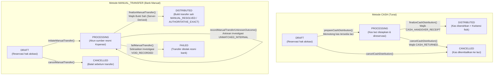

# BRI-6 — Cash & Manual Distribution Hardening Walkthrough

## 1. Ringkasan Eksekutif & Prinsip Bisnis

Fase **BRI-6 — Cash & Manual Distribution Hardening** memperkuat dan mengamankan dua metode distribusi non-QLola pada Sistem Keuangan Eskahade:
1. **`CASH`** (Penyaluran Tunai via Loket Kasir Koperasi)
2. **`MANUAL_TRANSFER`** (Transfer Bank Manual melalui Internet Banking / Teller / ATM)

### Prinsip Utama Finansial
- **`ALLOCATION = HAK DANA`**, sedangkan **`DISTRIBUTION = PENGIRIMAN DANA`**.
- Penyaluran offline/manual **bukan jalan pintas** untuk mengabaikan kontrol finansial. Metode `CASH` dan `MANUAL_TRANSFER` tunduk pada seluruh invariant ketat yang telah dibangun di `BRI_QLOLA`:
  - **Hard reservation** di tingkat basis data (mencegah overdraw alokasi lintas metode).
  - **Bukti serah terima / transfer append-only** yang tidak dapat diedit atau dihapus (`finance_cash_manual_evidence`).
  - **Pencegahan benturan referensi bukti** (*anti-collision*).
  - **Verifikasi provenance bukti**: bukti bertaraf `CANDIDATE` dilarang memfinalisasi status ke `DISTRIBUTED`.
  - **Otorisasi peran berjenjang** (Role-Based Access Control): bukti manual resmi mewajibkan operator berwenang (`admin` atau `bendahara`).
  - **Audit trail lengkap** dengan pencatatan sesi kas loket dan rekening sumber yayasan.
  - **Imutabilitas catatan historis**: koreksi pasca-penyaluran dialirkan ke antrean pemulihan (`PENDING_RECOVERY`), bukan merevisi histori masa lalu.

---

## 2. Status Migrasi Database

```text
REMOTE MIGRATION STATE 0182/0183/0184/0185/0186: NOT VERIFIED / UNKNOWN
```

*(Sesuai aturan ketat AGENTS.md, migrasi remote D1 tidak pernah dieksekusi secara otomatis oleh AI/coding agent. Zero remote migrations executed).*

- **Migrasi Baru yang Diterapkan**:
  - File: `migrations/0186_cash_manual_distribution_hardening.sql`
  - Bersifat **aditif murni**; file migrasi historis `0182_...` s.d. `0185_...` **100% utuh tanpa modifikasi**.
  - Menambahkan kolom `reason_code` dan `investigation_resolution` pada tabel `finance_reconciliation_items` untuk pelacakan semantik investigasi hasil transfer manual tanpa mengubah tabel lama.

---

## 3. Delapan Domain Hardening Kritis BRI-6

### 3.1. CASH PROCESSING RESERVES PHYSICAL SESSION CASH
- **Invariant**: Saat distribusi `CASH` beralih dari `DRAFT -> PROCESSING`, sistem tidak hanya mereservasi hak alokasi santri, melainkan **wajib mereservasi likuiditas kas fisik laci kasir secara atomik**.
- **Formula Ketersediaan Kas Fisik**:
  $$\text{available\_physical\_cash} = \text{expected\_closing\_balance} - \sum_{\text{other PROCESSING distributions}} \text{total\_amount}$$
- **Database Trigger Guard**: `trg_finance_dist_enforce_cash_session_balance` (UPDATE) dan `trg_finance_dist_enforce_cash_session_balance_insert` (INSERT) di tingkat SQLite/D1 memblokir transaksi jika:
  `NEW.total_amount + (SUM other PROCESSING on same session) > cs.expected_closing_balance`.
- **Pertahanan Multi-Alokasi & Konkurensi**: Dua alokasi berbeda yang disalurkan bersamaan (`Promise.all`) tidak dapat melakukan over-reservation terhadap laci kasir yang sama. Satu berhasil, yang melebihi pagu ditolak seketika di tingkat database trigger.

### 3.2. CASH SESSION IS OPERATOR-BOUND
- **Invariant**: Laci kasir fisik terikat secara ketat pada operator pemilik sesi (`session.operator_id === input.operatorId`).
- **Pencegahan Pemalsuan Identitas (Anti-Spoofing)**: Operator wajib terdaftar sah di tabel `users`. Pengguna bayangan atau tidak terdaftar ditolak seketika (*fail-closed*).
- **Enforcement Dua Arah**: Pemeriksaan kepemilikan laci kasir diberlakukan baik pada tahap penyiapan uang kas fisik (`prepareCashDistribution`) maupun tahap finalisasi serah terima (`finalizeCashDistribution`).
- **Supervisor Override & Jejak Audit**: Penggunaan laci kasir milik operator lain oleh sesama kasir ditolak keras (`OPERATOR_DRAWER_MISMATCH`). Pengalihan laci hanya diizinkan untuk peran supervisor (`admin` atau `bendahara`) dan dicatat secara eksplisit pada jejak audit:
  `[AUDIT] BRI_CASH_SESSION_SUPERVISOR_OVERRIDE`.

### 3.3. CASH SESSION CANNOT CLOSE WITH LIVE CASH RESERVATIONS
- **Invariant**: Sesi kasir loket (`finance_cash_sessions`) **DILARANG KERAS DITUTUP** selama masih ada uang fisik yang disiapkan di luar laci loket (status distribusi `PROCESSING`).
- **Database Trigger Guard**: `trg_finance_cash_session_prevent_close_with_live_reservations` membatalkan update status sesi dari `OPEN` ke `CLOSED` jika terdapat distribusi `CASH` berstatus `PROCESSING` yang terikat pada `cash_session_id` tersebut.
- **Service Layer Guard**: `closeCashSession` melakukan pre-check dan melemparkan exception terperinci berisi jumlah dan total nominal distribusi yang masih menggantung. Sesi kasir baru dapat ditutup setelah distribusi tunai selesai diserahterimakan (`DISTRIBUTED`) atau dibatalkan dengan bukti pengembalian uang fisik (`CASH_RETURNED`).
- **Rekonsiliasi Kas Fisik**: Selisih hitung fisik saat penutupan (`actual_closing_balance !== expected_closing_balance`) dicatat sebagai selisih berpenjelasan (`difference_notes`), bukan merevisi catatan mutasi historis.

### 3.4. CASH RESERVATION -> CASH OUT HANDOFF IS ATOMIC
- **Invariant**: Transisi dari reservasi kas fisik ke pengeluaran kas riil (`PROCESSING -> DISTRIBUTED`) dieksekusi dalam **satu unit transaksi atomik (`batch`)**:
  1. Penyisipan bukti serah terima fisik append-only `CASH_HANDOVER_RECEIPT` (dengan verifikasi tanda terima unik dan nama penerima fisik).
  2. Pemotongan kas fisik sesi loket (`total_cash_out` bertambah, `expected_closing_balance` berkurang).
  3. Pembaruan status header distribusi ke `DISTRIBUTED`.
  4. Pembaruan akumulasi hak alokasi santri (`disbursed_amount` dan `distribution_status = DISBURSED`).
- **Idempotensi & Anti-Double-Count**: `recalculateCashSession` membedakan secara tegas antara `total_cash_out` (kas keluar yang sudah selesai) dan `reserved_cash_out` (kas yang sedang disiapkan `PROCESSING`). Rekalkulasi berulang bersifat deterministik dan tidak menggandakan pemotongan kas.

### 3.5. SOURCE ACCOUNT COMES FROM ENV/MASTER, NOT CODE LITERAL
- **Invariant**: Rekening sumber penarikan dana transfer bank manual **bukan hardcoded literal string di dalam kode** dan bukan input bebas (*free-text*) dari klien.
- Rekening sumber diambil secara tunggal dari konfigurasi resmi Koperasi BRI (`loadBriConfig().collectionAccountNo` atau `process.env.BRI_COLLECTION_ACCOUNT_NO`).
- **Fail-Closed on Missing Config**: Jika konfigurasi nomor rekening belum didefinisikan di lingkungan sistem, fungsi `getAuthoritativeSourceAccount()` langsung melempar error `CONFIG_ERROR`, bukan menggunakan string fallback acak.
- Jika klien mengirimkan `sourceAccountNumber` atau `sourceAccountId` yang berbeda dari rekening resmi Koperasi BRI, server langsung menolaknya dengan error `INVALID_SOURCE_ACCOUNT`.

### 3.6. OPERATOR-SUPPLIED RECEIPT = MANUAL_RESOLVED
- **Invariant**: Bukti transfer yang diunggah oleh operator (tangkapan layar m-banking, foto slip setoran bank, atau berkas PDF dari kasir) **TIDAK DIANGGAP SEBAGAI `AUTHORITATIVE_EXACT`**.
- Walaupun format struk berasal dari bank, bukti tersebut secara sistem berstatus **`MANUAL_RESOLVED`** karena diunggah melalui perantara manusia.
- Klien **DILARANG MENDIKTE KEKUATAN BUKTI**: Nilai `evidenceStrength` yang dikirim oleh klien (misal mencoba mengklaim `AUTHORITATIVE_EXACT` pada `MANUAL_TRANSFER_SUCCESS`) diabaikan oleh server, dan disimpan ke basis data secara authoritatif sebagai `MANUAL_RESOLVED`.

### 3.7. STRONG STATEMENT IDENTITY != AUTHORITATIVE DISTRIBUTION MATCH
- **Prinsip Dasar**:
  ```text
  STRONG STATEMENT IDENTITY != AUTHORITATIVE DISTRIBUTION MATCH
  ```
- Kolom `transaction_id` pada rekening koran yang berstatus `identity_strength = STRONG` hanya membuktikan keaslian identitas baris mutasi perbankan. Ia **TIDAK OTOMATIS MEMBUKTIKAN** bahwa mutasi tersebut merupakan pemenuhan dari distribusi manual tertentu di Eskahade.
- **Status Kontrak Korelasi Otomatis**:
  ```text
  BANK_STATEMENT_DEBIT AUTO-CORRELATION TO MANUAL DISTRIBUTION: CONTRACT_TBD
  ```
- **Baseline Tanpa Korelasi Otoritatif**:
  ```text
  BANK_STATEMENT_DEBIT WITHOUT AUTHORITATIVE CROSS-REFERENCE = CANDIDATE
  ```
- Mutasi bank DEBIT yang nominal, rekening, dan waktunya cocok sekalipun, tanpa korelasi mesin-ke-mesin yang dijamin kontrak BRI, tetap berstatus **`CANDIDATE`**.
- **Ambiguity Guard**: Jika ada 2 atau lebih distribusi dengan nominal yang sama (misal keduanya Rp500.000) dan terdapat 1 mutasi bank DEBIT Rp500.000, sistem **DILARANG MEMILIH OTOMATIS** salah satu distribusi (`AMBIGUOUS_CANDIDATES`).

### 3.8. AUDITED MANUAL RECONCILIATION = MANUAL_RESOLVED
- **Prinsip Resolusi Audit**:
  ```text
  AUDITED MANUAL RECONCILIATION = MANUAL_RESOLVED
  ```
- Rekonsiliasi mutasi bank terhadap distribusi manual hanya sah jika dilakukan melalui audit manual oleh operator berwenang:
  - **Hanya peran `admin` atau `bendahara`** yang diizinkan (`assertManualProofAuthorizer`). Petugas kasir atau peran non-supervisor ditolak seketika.
  - Hasil resolusi audit manual mutasi bank disimpan dengan kekuatan bukti **`MANUAL_RESOLVED`** (BUKAN `AUTHORITATIVE_EXACT`).
  - Klaim klien yang mencoba memaksakan `evidenceStrength = AUTHORITATIVE_EXACT` atau `isReconciledAuthoritative = true` diabaikan secara tegas oleh server.
- **Validasi Mutasi Bank Otoritatif**:
  1. `STATEMENT_ACCOUNT_MISMATCH`: Nomor rekening mutasi wajib cocok dengan rekening operasional resmi Koperasi.
  2. `STATEMENT_TYPE_MISMATCH`: Mutasi wajib berjenis `DEBIT` (pengeluaran). Mutasi `CREDIT` ditolak keras.
  3. `STATEMENT_CURRENCY_MISMATCH`: Mata uang mutasi wajib `IDR`.
  4. `STATEMENT_AMOUNT_MISMATCH`: Nominal mutasi wajib cocok persis dengan nominal distribusi.
  5. `STMT_TRANSACTION_ALREADY_CONSUMED`: Satu mutasi bank hanya boleh digunakan untuk menyelesaikan maksimal 1 distribusi berstatus `DISTRIBUTED` (dilindungi oleh service check, unique partial index `uq_finance_distributions_stmt_tx`, dan trigger `trg_finance_dist_prevent_double_stmt_consumption`).
- **Seam Korelasi Masa Depan**:
  - Disediakan antarmuka `checkAuthoritativeBankStatementCrossReference` yang mengembalikan `{ isAuthoritativeExact: false, reason: '...', contractState: 'BANK_STATEMENT_AUTO_CORRELATION_CONTRACT_TBD' }`.
  - Tidak ada algoritma korelasi yang ditebak secara sepihak.

### 3.9. MANUAL UNKNOWN != AMOUNT_MISMATCH
- **Invariant**: Ketidakpastian hasil transfer manual akibat *timeout* jaringan, sambungan perbankan terputus, atau status transaksi menggantung **DILARANG DIPALSUKAN SEBAGAI `AMOUNT_MISMATCH`**.
- Saat `recordManualTransferUnknownOutcome` dipanggil:
  - Distribusi **TETAP BERSTATUS `PROCESSING`** (hak alokasi tetap direservasi / tidak dilepas).
  - Kasus investigasi dibuat di tabel `finance_reconciliation_items` dengan semantik jujur:
    - `match_status = 'UNMATCHED_INTERNAL'`
    - `reason_code = 'MANUAL_TRANSFER_OUTCOME_UNKNOWN'`
    - `resolution_action = 'NONE'`
    - `investigation_resolution = 'PENDING'`
  - **Blokir Transfer Ganda**: Keberadaan investigasi terbuka memblokir inisiasi transfer manual kedua pada distribusi tersebut (`UNRESOLVED_INVESTIGATION`).
- **Semantik Penyelesaian (Resolusi)**:
  - Jika transfer bank terbukti berhasil: diselesaikan ke `match_status = 'MATCHED'`, `investigation_resolution = 'DISTRIBUTION_CONFIRMED'`, dan `resolution_action = 'NONE'` (bukan disamarkan sebagai `ADJUSTMENT`).
  - Jika transfer bank terbukti gagal resmi: diselesaikan ke `investigation_resolution = 'VOID_RECORDED'` dan `resolution_action = 'VOID_RECORDED'`.

### 3.10. PROOF_BINARY_STORAGE: NOT IMPLEMENTED / DEFERRED
- **Pernyataan Status Penyimpanan Biner**:
  ```text
  PROOF_BINARY_STORAGE: NOT IMPLEMENTED / DEFERRED TO BRI-7 UI & STORAGE LIFECYCLE
  ```
- **Validasi Keamanan Berkas (Proof Security)**:
  - Allowlist MIME types: `image/jpeg`, `image/png`, `image/webp`, `application/pdf`.
  - Sniffing Magic Bytes dari buffer konten (Anti-Spoofing): berkas teks atau berkas berbahaya yang menyamar sebagai JPEG/PDF ditolak dengan error `MAGIC_BYTES_MISMATCH`.
  - Batas ukuran berkas maksimum 5 MB.
  - Sanitasi path traversal: penolakan karakter direktori (`..`, `/`, `\`) dan URL eksternal (`http://`, `https://`).
  - Menghasilkan kunci objek penyimpanan unik server-owned: `proofs/<uuid>.<ext>` dan kode bukti `PRF-<uuid>`.
  - Referensi bukti acak / URL sembarang yang dikirim klien langsung ditolak (`INVALID_PROOF_REFERENCE`).

---

## 4. Siklus Hidup & State Machine Metode Distribusi



---

## 5. Perlindungan Lintas Metode (Cross-Method Defense)

Sistem menjamin invariant:
> **Dana yang sedang tertahan (RESERVED) oleh metode apa pun (termasuk transfer intent QLola) DILARANG diambil oleh penyaluran CASH atau MANUAL_TRANSFER.**

Status yang menahan reservasi hak alokasi santri di tingkat basis data:
- `finance_distributions.status` IN (`PENDING_APPROVAL`, `PROCESSING`, `CANCEL_PENDING`)
- `finance_qlola_transfer_intents.intent_status` IN (`SUBMISSION_PENDING`, `UNKNOWN`, `CANCEL_PENDING`)

Trigger `trg_finance_dist_items_prevent_overdraw` secara otomatis memperhitungkan seluruh komitmen aktif di atas. Pembuatan draf atau eksekusi penyaluran tunai/manual yang melebihi sisa alokasi netto akan langsung digagalkan oleh trigger basis data.

---

## 6. Otorisasi Peran & Matriks Akses (RBAC)

### Matriks Otorisasi:
| Peran (Role) | Bikin Draf | Siapkan Kas (`CASH`) | Finalisasi Kas | Inisiasi Transfer Manual | Finalisasi Transfer Manual | Batalkan Penyaluran |
| :--- | :---: | :---: | :---: | :---: | :---: | :---: |
| `admin` | Ya | Ya (Supervisor) | Ya (Supervisor) | Ya | Ya (Semua Bukti) | Ya |
| `bendahara` | Ya | Ya (Supervisor) | Ya (Supervisor) | Ya | Ya (Semua Bukti) | Ya |
| `admin_koperasi` | Ya | Ya (Laci Sendiri) | Ya (Laci Sendiri) | Ya | Bukti Bank Saja | Ya |
| `petugas_koperasi` | Ya | Ya (Laci Sendiri) | Ya (Laci Sendiri) | Ya | Bukti Bank Saja | Draf Saja |
| `tester` | **TIDAK** | **TIDAK** | **TIDAK** | **TIDAK** | **TIDAK** | **TIDAK** |

---

## 7. Hasil Verifikasi Pengujian (100% Lolos)

### A. Test Suite BRI-6 (`scripts/test-bri-cash-manual-distribution.cjs`) — 66/66 Tests PASSED
- **Grup 1: Cross-Method Safety Tests (1 - 5)**:
  - ✓ 1. QLola SUBMISSION_PENDING blocks CASH overdraw.
  - ✓ 2. QLola UNKNOWN blocks manual transfer overdraw.
  - ✓ 3. QLola CANCEL_PENDING blocks alternative methods.
  - ✓ 4. Distributed + partial distribution accurately respects remaining entitlement.
  - ✓ 5. Concurrent CASH and MANUAL cannot overdraw allocation.
- **Grup 2: CASH Lifecycle & Evidence Tests (6 - 13)**:
  - ✓ 6. CASH DRAFT -> PROCESSING reserves allocation in DB.
  - ✓ 7. Insufficient cash session balance strictly blocked.
  - ✓ 8. CASH -> DISTRIBUTED without handover evidence blocked by trigger.
  - ✓ 9. CASH finalization is atomic across distribution, evidence, and cash session.
  - ✓ 10. Cancel before handover releases reservation cleanly.
  - ✓ 11. CASH_RETURNED evidence correctly recorded upon cancelling prepared cash.
  - ✓ 12. Cancellation after cash handover strictly blocked.
  - ✓ 13. Idempotent re-submission safe and duplicate receipt collision blocked.
- **Grup 3: MANUAL_TRANSFER Lifecycle & Evidence Tests (14 - 20)**:
  - ✓ 14. MANUAL_TRANSFER DRAFT -> PROCESSING reserves allocation in DB.
  - ✓ 15. Inactive destination account strictly blocked.
  - ✓ 16. MANUAL_TRANSFER -> DISTRIBUTED without success evidence blocked by trigger.
  - ✓ 17. Unknown transfer outcome remains in PROCESSING and preserves allocation reservation.
  - ✓ 18. Second transfer attempt while in PROCESSING is blocked.
  - ✓ 19. Authoritative transfer failure releases allocation reservation.
  - ✓ 20. Duplicate bank reference collision handled safely and blocked.
- **Grup 4: Evidence Immutability & Provenance Tests (21 - 25)**:
  - ✓ 21. Trigger trg_finance_cash_manual_evidence_immutable_update blocks UPDATE.
  - ✓ 22. Trigger trg_finance_cash_manual_evidence_immutable_delete blocks DELETE.
  - ✓ 23. CANDIDATE evidence strictly blocked from finalizing distribution.
  - ✓ 24. Manual official proof requires authenticated authorized operator (admin/bendahara).
  - ✓ 25. Spoofed / non-existent operator ID rejected by DB trigger.
- **Grup 5: Corrections & Recovery Integration Tests (26 - 28)**:
  - ✓ 26. Correction on distributed CASH allocation creates PENDING_RECOVERY case.
  - ✓ 27. Correction on distributed MANUAL allocation creates PENDING_RECOVERY case.
  - ✓ 28. Historical distribution and evidence completely intact after post-distribution correction.
- **Grup 6: Security, Proof Validation & Redaction Tests (29 - 32)**:
  - ✓ 29. Tester role strictly read-only and blocked from financial execution.
  - ✓ 30. Proof upload MIME allowlist, size limits, and path traversal guards verified.
  - ✓ 31. Account masking properly masks middle digits.
  - ✓ 32. Zero secret / credential leakage verified in audit logging sanitation.
- **Grup 7: Cash Session Reconciliation Invariants (33 - 40)**:
  - ✓ 33. PROCESSING cash reduces available physical cash (reserved: 400k, available: 600k).
  - ✓ 34. Two different allocations cannot over-reserve one cash session (600k available < 700k needed).
  - ✓ 35. Concurrent prepare (Promise.all) cannot over-reserve drawer (1 succeeded, 1 rejected).
  - ✓ 36. PROCESSING cash blocks cash-session close.
  - ✓ 37. CASH_RETURNED releases reservation completely (reserved: 0, available: 1M).
  - ✓ 38. DISTRIBUTED converts reservation to actual cash-out exactly once (idempotent, no double projection).
  - ✓ 39. Close succeeds after all reservations resolved.
  - ✓ 40. Actual counted cash mismatch creates discrepancy note, not ledger rewrite.
- **Grup 8: Manual Transfer Provenance & Reconciliation Investigation (41 - 56)**:
  - ✓ 41. Source account comes from authoritative Koperasi BRI account config/master.
  - ✓ 42. Arbitrary source account rejected.
  - ✓ 43. Caller cannot self-declare AUTHORITATIVE_EXACT; server derives evidence strength.
  - ✓ 44. BANK_STATEMENT amount/time-only candidate cannot finalize.
  - ✓ 45. Unknown outcome creates open investigation case with UNMATCHED_INTERNAL, reason_code, and PENDING.
  - ✓ 46. Unresolved investigation blocks second transfer.
  - ✓ 47. Uploaded receipt alone is MANUAL_RESOLVED and resolves investigation to DISTRIBUTION_CONFIRMED.
  - ✓ 48. Audited statement debit resolution yields MANUAL_RESOLVED (not AUTHORITATIVE_EXACT).
  - ✓ 49. Client cannot choose strength; server derives strength authoritatively.
  - ✓ 50. Missing BRI_COLLECTION_ACCOUNT_NO throws CONFIG_ERROR without code literal fallback.
  - ✓ 51. Operator drawer binding enforced in prepare (other operator blocked).
  - ✓ 52. Supervisor override allowed and audited for cash session drawer.
  - ✓ 53. Spoofed operator rejected by user existence check.
  - ✓ 54. Magic bytes mismatch strictly rejected (anti-spoofing verified).
  - ✓ 55. Path traversal and arbitrary client URLs strictly rejected.
  - ✓ 56. Failure resolution updates investigation item to VOID_RECORDED and UNMATCHED_INTERNAL.
- **Grup 9: Statement & Bank Reconciliation Hardening (57 - 66)**:
  - ✓ 57. Strong transactionId + same amount alone yields CANDIDATE (never AUTHORITATIVE_EXACT).
  - ✓ 58. Two equal-amount distributions result in AMBIGUOUS_CANDIDATES (no automatic selection).
  - ✓ 59. Amount + timestamp alone remains CANDIDATE (CONTRACT_TBD).
  - ✓ 60. Client AUTHORITATIVE_EXACT claim ignored; server strictly derives MANUAL_RESOLVED.
  - ✓ 61. Audited manual statement resolution strictly requires admin/bendahara and records full audit trail.
  - ✓ 62. Double consumption guard blocks reuse of statement transaction across distributions (`STMT_TRANSACTION_ALREADY_CONSUMED`).
  - ✓ 63. Statement with wrong account rejected (`STATEMENT_ACCOUNT_MISMATCH`).
  - ✓ 64. Statement with non-IDR currency rejected (`STATEMENT_CURRENCY_MISMATCH`).
  - ✓ 65. Statement with CREDIT type rejected (`STATEMENT_TYPE_MISMATCH`).
  - ✓ 66. Future cross-reference seam explicitly returns `CONTRACT_TBD` (no guessed correlation).

### B. Test Suite Migrasi 0186 (`scripts/test-migration-0186.cjs`) — 16/16 Tests PASSED
- Seluruh DDL, kolom tracking kas dan akun sumber, kolom `statement_transaction_id`, indeks unik parsial `uq_finance_distributions_stmt_tx`, trigger konsumsi ganda `trg_finance_dist_prevent_double_stmt_consumption`, trigger immutability, foreign key checks, cash session balance enforcement triggers, close prevention triggers, dan penambahan kolom investigasi rekonsiliasi lolos 100%.

### C. Regresi Keseluruhan Paket BRI — 100% PASSED
1. `node scripts/test-bri-distribution.cjs` (BRI-5 Suite) -> **Lolos 100%**
2. `node scripts/test-migration-0185.cjs` (Migrasi 0185) -> **Lolos 100%**
3. `node scripts/test-bri-settlement.cjs` (BRI-4 Suite) -> **Lolos 100%**
4. `node scripts/test-bri-collection.cjs` (BRI-3 Suite) -> **Lolos 100%**
5. `node scripts/test-bri-core.cjs` (BRI-2 Suite) -> **Lolos 100%**
6. `cmd /c npx tsc --noEmit` -> **0 Error (Bersih)**
7. `cmd /c npm run build` -> **Exit Code 0 (Production Build Berhasil)**
8. `git diff --check` -> **0 Whitespace / Conflict Marker Issues**

---

## 8. Kesiapan Fase Berikutnya

```text
BRI-7 READINESS: READY
```

### Usulan Git Commit Message:
```text
feat(finance): lock BRI-6 cash and manual distribution hardening flow
```

> **CATATAN PENTING**:
> Sesuai instruksi user dan aturan tata kelola repositori, pekerjaan **BERHENTI DI SINI**.
> Tidak boleh melangkah atau memulai pekerjaan fase **BRI-7** sebelum pengguna secara eksplisit memberikan instruksi persetujuan:
> `BRI-6 LOCKED`
