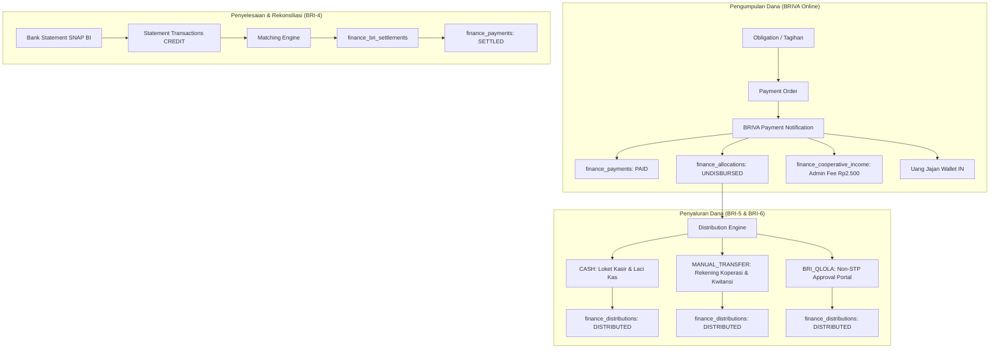

# Walkthrough Teknis Fase BRI-7: Reports, Cleanup, UAT & Go-Live

## Ringkasan Eksekutif

Fase **BRI-7** adalah fase penutup dari seluruh rangkaian integrasi finansial Eskahade dengan BRIAPI (BRI-0 s.d. BRI-6). Tujuan utama fase ini adalah:
1. Menyatukan seluruh rantai finansial: `Obligation` → `Payment Order` → `BRIVA Collection` → `Allocation` → `Bank Statement Settlement` → `Distribution (CASH / MANUAL / QLOLA)` → `Reconciliation & Recovery`.
2. Melakukan inventarisasi menyeluruh terhadap penghentian Duitku (Duitku Retirement) dengan target: **Jalur Runtime Aktif Duitku = 0**.
3. Menyediakan kontrol operasional *fail-closed* via Feature Flags dan *kill-switch* yang ditegakkan di sisi server pada seluruh titik masuk operasional.
4. Mengamankan penyimpanan bukti transaksi privat (Private R2 Bucket) dengan penegakan MIME, magic-bytes, SHA-256 hash, dan Role-Based Access Control (RBAC) tanpa peran palsu (*no invented roles*).
5. Membangun *Reporting Engine* terpadu dan *Automated Invariant Verifier* untuk menjamin konsistensi pembukuan dan integritas uang.
6. Menyediakan perangkat pengujian UAT deterministik serta dokumentasi *Production Runbook* dan *Go-Live Checklist*.

---

## 1. Rantai Arsitektur Finansial Terpadu (BRI-0 s.d. BRI-7)

Sistem Keuangan Baru mempertahankan pemisahan peran finansial secara ketat:

### Invariant Inti yang Dijamin:
1. **PAID != SETTLED**: Status `PAID` didapat saat webhook notifikasi BRIVA tervalidasi. Status `SETTLED` hanya diberikan setelah ada bukti mutasi kredit resmi dari Rekening Koran (Bank Statement).
2. **ALLOCATION != DISTRIBUTION**: Alokasi adalah hak dana per pos anggaran. Distribusi adalah instruksi fisik pengiriman uang kepada vendor penerima.
3. **UANG_JAJAN IS TITIPAN**: Dana Uang Jajan langsung masuk ke dompet santri dan dilarang keras didistribusikan ke Pesantren/Katering/Laundry.
4. **ADMIN KOPERASI != FEE BRI**: Admin Koperasi (Rp2.500) adalah pendapatan operasional Koperasi dan snapshot pada order. Fee BRI adalah beban bank terpisah. Keduanya tidak pernah dicampur aduk.
5. **NON-STP QLOLA**: Pengajuan via sistem berstatus `DRAFT` atau `PENDING_APPROVAL`. Eksekusi transfer hanya dapat dilakukan oleh Signer resmi di portal QLola eksternal BRI. Eksekusi langsung dimatikan (`QLOLA_REAL_SUBMISSION_STATE = DISABLED`).
6. **CROSS-METHOD RESERVATION**: Alokasi yang sedang diproses di metode apa pun (`BRI_QLOLA`, `CASH`, atau `MANUAL_TRANSFER`) dibekukan (*reserved*) di tingkat database sehingga tidak dapat ditarik ganda.
7. **CASH SESSION LIQUIDITY GUARD**: Pengeluaran tunai (`CASH`) yang sedang berstatus `PROCESSING` langsung memotong saldo kas fisik yang tersedia di laci kasir agar kas tidak mengalami *over-draw*.

---

## 2. Inventarisasi Akhir Duitku (Duitku Final Inventory)

Pembersihan menyeluruh terhadap gateway lama (Duitku) telah diverifikasi di seluruh repositori:

| Kategori | Jumlah Referensi | Keterangan & Tindakan |
|---|---|---|
| **Active Runtime Paths** | **0** | Tidak ada rute API aktif, controller, antarmuka checkout, atau logika pembayaran runtime yang memanggil Duitku. |
| **Historical Migrations** | 6 Berkas | Migrasi 0155, 0158, 0165, 0168, 0170, dan 0182 tetap mempertahankan skema/data lama agar tidak merusak rekam jejak historis yang sudah diterapkan di masa lalu (*read-only historical audit*). |
| **Legacy Test Fixtures** | 4 Berkas | Berkas skrip uji migrasi lama (`scripts/test-migration-0182.cjs`, `scripts/test-finance-*.py`) memverifikasi bahwa tabel lama dibersihkan secara aman saat migrasi. |
| **Documentation & Types** | 2 Berkas | Penjelasan historis di `docs/` dan komentar edukatif di `lib/finance/payment-types.ts`. |

**Kesimpulan**: `ACTIVE DUITKU RUNTIME PATHS = 0`. Tidak ada fitur baru yang dapat memilih atau memproses pembayaran melalui Duitku.

---

## 3. Audit RBAC & Eliminasi Peran Palsu (Role Drift Audit)

Berdasarkan pemeriksaan kanonik terhadap `lib/auth/session.ts` dan `lib/db/index.ts`:

1. **Matriks Peran Keuangan Kanonik**:
   - `admin`: Hak penuh kelola modul keuangan dan persetujuan rekonsiliasi.
   - `bendahara`: Hak penuh pengelolaan kas, verifikasi kwitansi, dan finalisasi transfer.
   - `admin_koperasi`: Hak kelola penagihan BRIVA dan operasional koperasi.
   - `petugas_koperasi`: Hak pembukuan dan operasional loket.
   - `pimpinan`: Bersifat **READ-ONLY**. Hanya boleh melihat laporan keuangan, dilarang memutasi transaksi atau memfinalisasi penyaluran.
   - `tester`: Bersifat **READ-ONLY** (ditegakkan di tingkat database proxy `wrapReadOnlyDB` pada `lib/db/index.ts`).
2. **Eliminasi Peran Palsu**:
   - Peran `superadmin` tidak pernah ada dalam skema otentikasi Eskahade dan telah **dihapus** dari allowlist `proof-storage-service.ts`.
3. **Pemisahan Izin Bukti Transaksi**:
   - Pengunggahan bukti: Memerlukan peran mutasi keuangan aktif (`FINANCE_MUTATE_ROLES`).
   - Pembacaan/pengunduhan bukti: Dibatasi hanya untuk peran keuangan resmi (`admin`, `bendahara`, `admin_koperasi`, `petugas_koperasi`). Akses oleh `wali`, `santri`, atau publik ditolak dengan status 403 Forbidden.

---

## 4. Penegakan Aturan Kanonik Santri Bebas Tagihan

Sesuai modul kanonik `lib/finance/non-billable-santri.ts` dan skema migrasi `0052_santri_kategori_sadesa.sql`:
- **AL-BAGHORY (Bebas Total)**:
  - Menggunakan helper `isAsramaBebasTagihan(asrama)`.
  - Santri penduduk setempat berasrama AL-BAGHORY dibebaskan total dari seluruh tagihan keuangan (0 VA, 0 tagihan, tidak muncul di modul penagihan).
- **SADESA (Bebas Parsial Makan & Nyuci)**:
  - Menggunakan kolom `kategori_santri = 'SADESA'` dan helper `isSantriBebasItem(..., itemType)`.
  - Otomatis dibebaskan dari tagihan `UANG_MAKAN` dan `UANG_NYUCI`.
  - Tagihan SPP, EHB, Ekskul, Kesehatan, dan USPP tetap ditagihkan secara reguler.
- Seluruh query laporan dan seeder UAT menggunakan predikat SQL kanonik `nonBillableSantriSqlPredicate('asrama', true)` dan memeriksa kolom resmi `status_global = 'aktif'` dan `kategori_santri`.

---

## 5. Komponen Kunci Fase BRI-7

### 5.1 Feature Flags & Server-Side Entrypoint Enforcement (`lib/finance/bri/feature-flags.ts`)
Mengendalikan aktivasi bertahap setiap fitur perbankan dengan default *fail-closed*:
- Penyaluran `CASH` diblokir di sisi server jika `BRI_DIST_CASH_ENABLED=false`.
- Penyaluran `MANUAL_TRANSFER` diblokir jika `BRI_DIST_MANUAL_ENABLED=false`.
- Sinkronisasi mutasi diblokir jika `BRI_STATEMENT_SYNC_ENABLED=false`.
- Inbound webhook diblokir jika `BRI_BRIVA_INBOUND_ENABLED=false`.
- QLola selalu diblokir (`QLOLA_H2H_CONTRACT_STATE = 'QLOLA_H2H_CONTRACT_TBD'` dan `QLOLA_REAL_SUBMISSION_STATE = 'DISABLED'`).

### 5.2 Private Financial Proof Storage (`lib/finance/bri/proof-storage-service.ts`)
- Format berkas: JPEG, PNG, WEBP, PDF (max 5 MB).
- Sniffing magic-bytes biner (anti-spoofing).
- Kunci privat acak `proofs/financial/${uuid}.${ext}`.
- Hash SHA-256 tersimpan untuk integritas audit.
- Otorisasi RBAC ketat.
- **Fail-Closed di Produksi**: Jika dijalankan di lingkungan produksi (`BRI_ENV=production`), ketiadaan Cloudflare R2 bucket binding langsung menolak transaksi (*fail closed*). Mode fallback hanya diizinkan di lingkungan pengujian/demo.

### 5.3 Reporting Engine & Invariant Asserter (`lib/finance/bri/audit-report-service.ts`)
- Agregasi lengkap: Collection, Accounting, Distribution, Reconciliation.
- Verifikasi 8 Invariant Keras perbankan dengan uji kekacauan (*chaos testing*).

---

## 6. Hasil Eksekusi Regresi Penuh (Full Regression Test Run)

Seluruh 11 test suite perbankan dijalankan dengan hasil 100% lulus:

| No | Modul / Test Suite | Skrip Pengujian | Jumlah Pengujian |
|---|---|---|---|
| 1 | Migration 0182: BRI Foundation & Duitku Purge | `scripts/test-migration-0182.cjs` | 33 Skenario |
| 2 | BRI-2: Security, Token & Transport Crypto | `scripts/test-bri-core.cjs` | 25 Skenario |
| 3 | Migration 0183: BRIVA Collection Metadata | `scripts/test-migration-0183.cjs` | 8 Skenario |
| 4 | BRI-3: BRIVA Inbound Collection & Webhook | `scripts/test-bri-collection.cjs` | 28 Skenario |
| 5 | Migration 0184: Settlement & Recovery Schema | `scripts/test-migration-0184.cjs` | 19 Skenario |
| 6 | BRI-4: Settlement Engine & Bank Statement | `scripts/test-bri-settlement.cjs` | 27 Skenario |
| 7 | Migration 0185: QLola Distribution Schema | `scripts/test-migration-0185.cjs` | 11 Skenario |
| 8 | BRI-5: BRI/QLola Non-STP Distribution | `scripts/test-bri-distribution.cjs` | 37 Skenario |
| 9 | Migration 0186: Cash & Manual Distribution | `scripts/test-migration-0186.cjs` | 17 Skenario |
| 10 | BRI-6: Cash Desk Drawer & Manual Transfer | `scripts/test-bri-cash-manual-distribution.cjs` | 66 Skenario |
| 11 | BRI-7: Reports, Entrypoint Flags & Chaos Asserter | `scripts/test-bri-audit-reports.cjs` | 16 Skenario |
| **TOTAL** | **Seluruh Rangkaian Invariant Finansial** | - | **287 Skenario LULUS (100%)** |

- Kompilasi TypeScript (`npx tsc --noEmit`): **0 Error**.
- Kompilasi Produksi Next.js (`npm run build`): **Lulus 100%**.
- Pemeriksaan Whitespace Git (`git diff --check`): **Bersih**.

---

## 7. Matriks Status Kesiapan Faktual (Factual Readiness Matrix)

| Domain Verifikasi | Status Faktual | Penjelasan & Batasan |
|---|---|---|
| **CODE READINESS** | **READY** | Kode, tipe data, skema migrasi 0182–0186, trigger, dan service siap. Kompilasi TS dan build Next.js lulus code 0. |
| **LOCAL DOMAIN/UAT SIMULATION** | **PASS (287/287)** | 287/287 tes lulus. Local SQLite/D1-compatible domain simulation using the same migration SQL and financial invariants. **REMOTE D1 BEHAVIOR: NOT YET VERIFIED**. |
| **DEMO REMOTE MIGRATION** | **NOT VERIFIED — CLOUDFLARE AUTH BLOCKED** | Status remote migrasi 0182–0186 pada `eskahade-demo-db` (ID: `677f05ba-9b52-4534-9542-96cc785f25e4`) belum terverifikasi karena OAuth token CLI kedaluwarsa. |
| **DEMO REMOTE UAT** | **NOT EXECUTED** | Belum dieksekusi pada D1 remote demo karena otentikasi CLI Cloudflare terblokir. |
| **PRODUCTION REMOTE PREFLIGHT** | **NOT EXECUTED — CLOUDFLARE AUTH BLOCKED** | Pemeriksaan remote D1 terhadap `eskahade-db` belum dieksekusi. Hanya konfigurasi statis repo dan berkas SQL yang terverifikasi. **PRODUCTION DATA PREFLIGHT REQUIRES RESTORED CLOUDFLARE AUTH**. |
| **PRODUCTION MIGRATION** | **NOT EXECUTED** | Database produksi `eskahade-db` (ID: `a2010f08-f314-46af-88fd-dbb9b4ef1bb1`) **TIDAK DIMIGRASI / HARD GATED**. |
| **BRI SANDBOX INTEROPERABILITY** | **NOT VERIFIED / EXTERNAL GATE** | Belum ada panggilan HTTP nyata ke endpoint BRI Sandbox. Menunggu kredensial Sandbox dari PIC IT BRI. |
| **BRI PRODUCTION CREDENTIALS** | **PENDING ONBOARDING** | Kunci privat, Client Key, dan X-PARTNER-ID produksi belum diterbitkan. Sistem dalam status *fail-closed*. |
| **R2 CODE READINESS** | **READY / REMOTE DEMO R2 NOT VERIFIED** | Layanan Private R2 Bucket siap dengan validasi ketat. Fail-closed di produksi (`R2_BUCKET_UNAVAILABLE`). Live binding remote belum diakses. |
| **QLOLA** | **DEFERRED / CONTRACT_TBD / HARD DISABLED** | Di luar cakupan rilis awal (*out of initial launch scope*). Bukan mandatory initial-go-live gate. Hanya wajib sebelum fitur BRI_QLOLA diaktifkan. |
| **OVERALL INITIAL GO-LIVE** | **NOT READY — EXTERNAL GATES OPEN** | Kode dan simulasi domain lokal siap, peluncuran produksi ditahan (*fail-closed*) menunggu gerbang eksternal wajib terbuka. |

