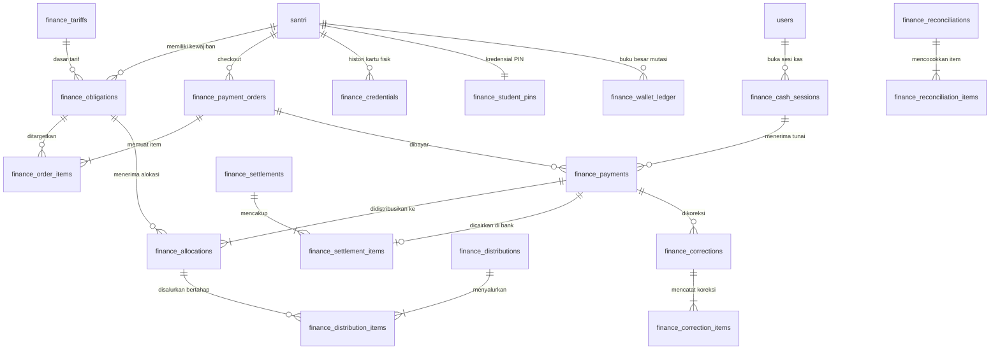

# Implementation Plan (Final): Sistem Keuangan Baru Pesantren

Dokumen ini merupakan rancangan arsitektur teknis final untuk **Sistem Keuangan Baru Pesantren** pada codebase `eskahade`, yang disusun berlandaskan:
1. `AGENTS.md` (Tata cara kerja, aturan non-destruktif, isolasi scope);
2. `docs/SISTEM_KEUANGAN_BARU_PRD.md` (Source of truth requirement produk dan business rules);
3. `docs/UI_UX_GUIDELINES.md` (Source of truth desain visual, interaksi, dan benchmark UI);
4. Kondisi faktual codebase `eskahade` pada commit `0a683af4`.

---

## 1. Audit Codebase & Pemanfaatan Komponen Existing

### 1.1 Komponen Reusable (Tanpa Duplikasi)

| Area / Modul | File / Objek Existing | Pemanfaatan (Reuse) |
|---|---|---|
| **Database Access** | `lib/db/index.ts` | Menggunakan helper `query`, `queryOne`, `execute`, dan `batch`. Seluruh mutasi finansial multi-step dirangkai ke dalam prepared statements dan dieksekusi secara atomik via `await db.batch(statements)`. |
| **Master Santri** | Tabel `santri` | Sumber kebenaran tunggal data santri (`id`, `nis`, `nama_lengkap`, `asrama`, `kamar`, `tempat_makan_id`, `tempat_mencuci_id`, `no_wa_ortu`). Dilarang membuat duplikasi tabel santri. |
| **Kredensial Portal Ortu** | Tabel `portal_ortu_credentials` | Tetap menjadi jangkar autentikasi akun wali santri berbasis `santri_id`. |
| **Master Provider Layanan** | Tabel `master_jasa` | Master vendor katering (`jenis = 'Makan'`) dan laundry (`jenis = 'Cuci'`). Sistem keuangan baru hanya menambahkan rekening pembayaran penyedia dan snapshot hak penyaluran tanpa menduplikasi data vendor. |
| **Autentikasi & Multi-Role** | `lib/auth/session.ts`, `lib/auth/feature.ts`, `fitur_akses` | Multi-role via `users.roles` (JSON string array) dan gate otorisasi `canAccessHref()`. Mendaftarkan role baru `admin_koperasi` dan `petugas_koperasi`, serta memigrasikan role lama `petugas_loket`. |
| **Kriptografi & Password Hashing** | `lib/auth/password.ts` | Menggunakan fungsi native PBKDF2 Web Crypto API (`hashPassword` dan `verifyPassword`) dengan 100.000 iterasi dan salt 16-byte acak untuk mengamankan PIN santri. |
| **Komponen UI & Layout Shell** | `components/layout/sidebar.tsx`, `components/dashboard/page-header.tsx`, `components/ui/pagination.tsx`, `components/ui/confirm-dialog.tsx`, `components/ui/santri-photo-avatar.tsx`, `components/ui/skeletons.tsx` | Seluruh antarmuka baru mengikuti design tokens, layout shell, sidebar navigation, dan dialog konfirmasi existing. |
| **Pustaka & Dependencies** | `package.json` | Memaksimalkan dependency existing: Tailwind CSS v4, Lucide React, Phosphor Icons, `@tanstack/react-table`, `sonner`, `date-fns`, `react-to-print`, `xlsx`, `xlsx-js-style`. **Nol instalasi package npm baru**. |

---

## 2. Authoritative Data vs Derived / Cached Balances

Untuk menjamin integritas data dan auditability:

### 2.1 Sumber Kebenaran Mutlak (Authoritative Source of Truth)
1. **Status Kewajiban Tagihan**: Dihitung dari akumulasi `SUM(finance_allocations.amount)` yang berstatus aktif terhadap `amount_expected - amount_exempted` pada `finance_obligations`.
2. **Saldo Uang Jajan**: Dihitung dari akumulasi mutasi buku besar:
   $$\text{Saldo} = \sum \text{IN} - \sum \text{OUT}$$
   pada tabel `finance_wallet_ledger`.
3. **Koreksi Finansial (Void, Reversal, Refund)**: Seluruh koreksi tercatat secara independen di `finance_corrections` dan `finance_correction_items`. Fakta historis bahwa payment pernah diterima tetap dipertahankan.
4. **Saldo Kas Fisik & Expected Kasir**: Dihitung dari `opening_balance + SUM(tunai masuk) - SUM(tunai keluar)` dari transaksi pembayaran, penarikan, dan refund tunai yang berelasi ke `cash_session_id`.
5. **Dana Tersedia untuk Penyaluran (Available for Distribution)**: Dihitung secara presisi per alokasi:
   $$\text{Sisa Siap Salur per Alokasi} = \text{allocation.amount} - \sum \text{distribution\_items.amount}$$
   hanya untuk alokasi dengan `distribution_status` `'UNDISBURSED'` atau `'PARTIALLY_DISBURSED'`.
6. **Status Settlement Gateway**: Ditentukan dari keterkaitan payment pada `finance_settlement_items`.

### 2.2 Saldo Proyeksi / Cache (Derived Fields)
- `finance_obligations.amount_paid` dan `status`: Diperbarui untuk kebutuhan rendering cepat tabel dan query performa.
- `finance_allocations.disbursed_amount` dan `distribution_status`: Cache agregat penyaluran alokasi.
- `finance_payments.correction_status`: Cache indikator koreksi (`'NONE' | 'PARTIALLY_CORRECTED' | 'FULLY_CORRECTED'`).
- `santri.saldo_uang_jajan`: Proyeksi cepat saldo santri.
- `finance_cash_sessions.total_cash_in`, `total_cash_out`, `expected_closing_balance`: Proyeksi agregat sesi kas.

### 2.3 Mekanisme Rekalkulasi & Rebuild
- Seluruh pembaruan ke field derived/cache **WAJIB** dilakukan dalam batch statement D1 yang sama (`db.batch`) dengan mutasi authoritative ledger/alokasi terkait.
- Disediakan modul audit mandiri untuk merekonstruksi seluruh derived cache:
  - `recalculateStudentWallet(santriId)`
  - `recalculateObligation(obligationId)`
  - `recalculateAllocationDisbursement(allocationId)`
  - `recalculateCashSession(sessionId)`

---

## 3. Proposed Data Model

Semua tabel menggunakan prefix `finance_` dan nominal uang disimpan dalam tipe `INTEGER` (Rupiah).



### 3.1 Modul Tarif, Pembebasan & Kewajiban
1. **`finance_tariffs`**
   - `id` (TEXT PK)
   - `item_type` (TEXT NOT NULL: `'SPP' | 'UANG_MAKAN' | 'UANG_NYUCI' | 'EHB' | 'EKSKUL' | 'KESEHATAN' | 'USPP'`)
   - `academic_year_id` (INTEGER REFERENCES `tahun_ajaran(id)`)
   - `nominal` (INTEGER NOT NULL)
   - `installment_rule` (TEXT NOT NULL DEFAULT 'DISALLOWED': `'DISALLOWED' | 'ALLOWED'`) -- *USPP selalu 'ALLOWED'; SPP selalu 'DISALLOWED'*
   - `effective_from` (TEXT NOT NULL: YYYY-MM-DD)
   - `effective_until` (TEXT: YYYY-MM-DD)
   - `created_by` (TEXT REFERENCES `users(id)`)
   - `created_at` (TEXT)

2. **`finance_exemptions`**
   - `id` (TEXT PK)
   - `santri_id` (TEXT NOT NULL REFERENCES `santri(id)`)
   - `item_type` (TEXT NOT NULL)
   - `academic_year_id` (INTEGER REFERENCES `tahun_ajaran(id)`)
   - `period_start` (TEXT: YYYY-MM)
   - `period_end` (TEXT: YYYY-MM)
   - `reason` (TEXT NOT NULL)
   - `created_by` (TEXT REFERENCES `users(id)`)
   - `created_at` (TEXT)

3. **`finance_obligations`**
   - `id` (TEXT PK)
   - `santri_id` (TEXT NOT NULL REFERENCES `santri(id)`)
   - `item_type` (TEXT NOT NULL)
   - `academic_year_id` (INTEGER REFERENCES `tahun_ajaran(id)`)
   - `period` (TEXT NOT NULL: YYYY-MM untuk bulanan, YYYY untuk tahunan, `'LIFETIME'` untuk USPP)
   - `tariff_id` (TEXT REFERENCES `finance_tariffs(id)`)
   - `amount_expected` (INTEGER NOT NULL)
   - `amount_exempted` (INTEGER NOT NULL DEFAULT 0)
   - `amount_paid` (INTEGER NOT NULL DEFAULT 0) -- *derived cache*
   - `status` (TEXT NOT NULL DEFAULT 'UNPAID': `'UNPAID' | 'PARTIALLY_PAID' | 'PAID' | 'EXEMPTED'`)
   - `provider_id` (TEXT REFERENCES `master_jasa(id)` -- snapshot katering/laundry)
   - `created_at` (TEXT)
   - `updated_at` (TEXT)
   - *INDEX UNIQUE*: `(santri_id, item_type, period)`

### 3.2 Modul Order, Pembayaran & Alokasi
4. **`finance_student_va`** (Pemetaan Fixed VA Permanen)
   - `santri_id` (TEXT PRIMARY KEY REFERENCES `santri(id)`)
   - `va_number` (TEXT NOT NULL UNIQUE)
   - `bank_code` (TEXT NOT NULL)
   - `created_at` (TEXT)

5. **`finance_payment_orders`**
   - `id` (TEXT PK)
   - `order_number` (TEXT NOT NULL UNIQUE: contoh `ORD-20260919-XXXX`)
   - `santri_id` (TEXT NOT NULL REFERENCES `santri(id)`)
   - `payer_type` (TEXT NOT NULL: `'PORTAL_ORTU' | 'LOKET'`)
   - `gross_amount` (INTEGER NOT NULL) -- total tagihan murni
   - `gateway_fee` (INTEGER NOT NULL DEFAULT 0) -- biaya gateway
   - `fee_payer` (TEXT NOT NULL DEFAULT 'CUSTOMER': `'CUSTOMER' | 'INSTITUTION'`) -- siapa yang menanggung fee
   - `total_charged` (INTEGER NOT NULL) -- gross + (fee jika ditanggung customer)
   - `payment_method` (TEXT: `'DUITKU_VA' | 'DUITKU_QRIS' | 'CASH'`)
   - `fixed_va_number` (TEXT) -- nomor Fixed VA santri yang ditargetkan
   - `status` (TEXT NOT NULL DEFAULT 'PENDING': `'PENDING' | 'PAID' | 'EXPIRED' | 'CANCELLED'`)
   - `expires_at` (TEXT NOT NULL)
   - `cash_session_id` (TEXT REFERENCES `finance_cash_sessions(id)`)
   - `created_at` (TEXT)
   - `updated_at` (TEXT)

6. **`finance_order_items`**
   - `id` (TEXT PK)
   - `order_id` (TEXT NOT NULL REFERENCES `finance_payment_orders(id)`)
   - `obligation_id` (TEXT REFERENCES `finance_obligations(id)`) -- NULL jika top-up jajan
   - `item_type` (TEXT NOT NULL)
   - `amount` (INTEGER NOT NULL)

7. **`finance_payments`**
   - `id` (TEXT PK)
   - `payment_number` (TEXT NOT NULL UNIQUE: contoh `PAY-20260919-XXXX`)
   - `order_id` (TEXT REFERENCES `finance_payment_orders(id)`) -- NULL jika transfer Fixed VA tanpa order aktif
   - `santri_id` (TEXT NOT NULL REFERENCES `santri(id)`)
   - `channel` (TEXT NOT NULL: `'DUITKU' | 'CASH'`)
   - `method` (TEXT NOT NULL)
   - `gross_amount` (INTEGER NOT NULL)
   - `gateway_fee` (INTEGER NOT NULL DEFAULT 0)
   - `net_amount` (INTEGER NOT NULL)
   - `status` (TEXT NOT NULL DEFAULT 'PAID': `'PAID' | 'SETTLED'`) -- *fakta historis pembayaran tidak diubah menjadi void*
   - `correction_status` (TEXT NOT NULL DEFAULT 'NONE': `'NONE' | 'PARTIALLY_CORRECTED' | 'FULLY_CORRECTED'`) -- *derived cache koreksi*
   - `allocation_status` (TEXT NOT NULL DEFAULT 'ALLOCATED': `'ALLOCATED' | 'PARTIALLY_ALLOCATED' | 'UNALLOCATED'`)
   - `paid_at` (TEXT NOT NULL)
   - `external_reference` (TEXT) -- Duitku reference
   - `cash_session_id` (TEXT REFERENCES `finance_cash_sessions(id)`)
   - `received_by` (TEXT REFERENCES `users(id)`)
   - `created_at` (TEXT)

8. **`finance_allocations`**
   - `id` (TEXT PK)
   - `payment_id` (TEXT NOT NULL REFERENCES `finance_payments(id)`)
   - `obligation_id` (TEXT REFERENCES `finance_obligations(id)`) -- NULL jika ke uang jajan
   - `target_type` (TEXT NOT NULL: `'OBLIGATION' | 'UANG_JAJAN'`)
   - `item_type` (TEXT NOT NULL)
   - `provider_id` (TEXT REFERENCES `master_jasa(id)`) -- snapshot vendor katering/laundry
   - `amount` (INTEGER NOT NULL)
   - `disbursed_amount` (INTEGER NOT NULL DEFAULT 0) -- *derived cache akumulasi penyaluran*
   - `distribution_status` (TEXT NOT NULL DEFAULT 'UNDISBURSED': `'UNDISBURSED' | 'PARTIALLY_DISBURSED' | 'DISBURSED'`)
   - `created_at` (TEXT)

### 3.3 Modul Settlement
9. **`finance_settlements`**
   - `id` (TEXT PK)
   - `settlement_number` (TEXT NOT NULL UNIQUE: contoh `STL-20260919-XXXX`)
   - `provider` (TEXT NOT NULL DEFAULT 'DUITKU')
   - `settlement_date` (TEXT NOT NULL: YYYY-MM-DD)
   - `destination_bank` (TEXT NOT NULL)
   - `destination_account` (TEXT NOT NULL)
   - `total_payments_count` (INTEGER NOT NULL)
   - `total_gross_amount` (INTEGER NOT NULL)
   - `total_fee_amount` (INTEGER NOT NULL)
   - `total_net_amount` (INTEGER NOT NULL)
   - `status` (TEXT NOT NULL DEFAULT 'COMPLETED': `'PENDING' | 'COMPLETED' | 'DISCREPANCY'`)
   - `notes` (TEXT)
   - `verified_by` (TEXT REFERENCES `users(id)`)
   - `created_at` (TEXT)

10. **`finance_settlement_items`**
    - `id` (TEXT PK)
    - `settlement_id` (TEXT NOT NULL REFERENCES `finance_settlements(id)`)
    - `payment_id` (TEXT NOT NULL UNIQUE REFERENCES `finance_payments(id)`)
    - `gross_amount` (INTEGER NOT NULL)
    - `gateway_fee` (INTEGER NOT NULL)
    - `net_amount` (INTEGER NOT NULL)
    - `created_at` (TEXT)

### 3.4 Modul Penyaluran (Mendukung Parsial & Multi-Metode)
11. **`finance_distributions`**
    - `id` (TEXT PK)
    - `distribution_number` (TEXT NOT NULL UNIQUE: contoh `DIS-20260919-XXXX`)
    - `recipient_type` (TEXT NOT NULL: `'BENDAHARA' | 'KATERING' | 'LAUNDRY'`)
    - `recipient_id` (TEXT REFERENCES `master_jasa(id)`) -- NULL jika ke bendahara
    - `item_type` (TEXT NOT NULL)
    - `period` (TEXT NOT NULL: YYYY-MM atau YYYY)
    - `total_amount` (INTEGER NOT NULL)
    - `method` (TEXT NOT NULL: `'TRANSFER' | 'CASH'`)
    - `destination_bank` (TEXT) -- nullable jika CASH
    - `destination_account` (TEXT) -- nullable jika CASH
    - `account_holder_name` (TEXT) -- nullable jika CASH
    - `proof_attachment_url` (TEXT)
    - `transferred_by` (TEXT NOT NULL REFERENCES `users(id)`)
    - `transferred_at` (TEXT NOT NULL)
    - `notes` (TEXT)
    - `created_at` (TEXT)

12. **`finance_distribution_items`** (Linkage Alokasi Multi-Penyaluran)
    - `id` (TEXT PK)
    - `distribution_id` (TEXT NOT NULL REFERENCES `finance_distributions(id)`)
    - `allocation_id` (TEXT NOT NULL REFERENCES `finance_allocations(id)`) -- *TIDAK UNIQUE, mendukung penyaluran parsial berulang*
    - `amount` (INTEGER NOT NULL)
    - `created_at` (TEXT)
    - *INDEX*: `idx_dist_items_allocation (allocation_id)`

13. **`finance_provider_accounts`**
    - `id` (TEXT PK)
    - `provider_id` (TEXT NOT NULL REFERENCES `master_jasa(id)`)
    - `bank_name` (TEXT NOT NULL)
    - `account_number` (TEXT NOT NULL)
    - `account_holder` (TEXT NOT NULL)
    - `notes` (TEXT)
    - `created_at` (TEXT)

### 3.5 Modul Koreksi (Refund, Reversal, & Void)
14. **`finance_corrections`**
    - `id` (TEXT PK)
    - `correction_number` (TEXT NOT NULL UNIQUE: contoh `COR-20260919-XXXX`)
    - `correction_type` (TEXT NOT NULL: `'VOID' | 'REVERSAL' | 'REFUND'`)
    - `target_payment_id` (TEXT NOT NULL REFERENCES `finance_payments(id)`)
    - `total_amount` (INTEGER NOT NULL) -- mendukung partial koreksi
    - `method` (TEXT: `'CASH' | 'TRANSFER' | 'GATEWAY'`) -- *mendukung 'GATEWAY' jika payment gateway mendukung refund API; nullable (dapat bernilai NULL) untuk koreksi pembukuan murni (internal adjustment/void sistem) tanpa perpindahan dana fisik/eksternal*
    - `reason` (TEXT NOT NULL)
    - `cash_session_id` (TEXT REFERENCES `finance_cash_sessions(id)`) -- jika refund tunai di loket
    - `approved_by` (TEXT REFERENCES `users(id)`)
    - `created_by` (TEXT NOT NULL REFERENCES `users(id)`)
    - `created_at` (TEXT)

15. **`finance_correction_items`**
    - `id` (TEXT PK)
    - `correction_id` (TEXT NOT NULL REFERENCES `finance_corrections(id)`)
    - `target_allocation_id` (TEXT REFERENCES `finance_allocations(id)`)
    - `obligation_id` (TEXT REFERENCES `finance_obligations(id)`)
    - `target_type` (TEXT NOT NULL: `'OBLIGATION' | 'UANG_JAJAN'`)
    - `amount` (INTEGER NOT NULL)
    - `created_at` (TEXT)

### 3.6 Modul Kredensial, PIN & Uang Jajan
16. **`finance_credentials`** (Kartu Fisik Multi-Histori dengan Tepat Satu Aktif)
    - `id` (TEXT PK)
    - `santri_id` (TEXT NOT NULL REFERENCES `santri(id)`)
    - `card_token` (TEXT NOT NULL UNIQUE) -- token acak nanoid/UUID
    - `status` (TEXT NOT NULL DEFAULT 'ACTIVE': `'ACTIVE' | 'REVOKED' | 'LOST' | 'BLOCKED'`)
    - `issued_at` (TEXT NOT NULL)
    - `issued_by` (TEXT REFERENCES `users(id)`)
    - `revoked_at` (TEXT)
    - `revoked_by` (TEXT REFERENCES `users(id)`)
    - `revocation_reason` (TEXT)
    - *PARTIAL UNIQUE INDEX*:
      `CREATE UNIQUE INDEX uq_active_card_per_santri ON finance_credentials(santri_id) WHERE status = 'ACTIVE';`

17. **`finance_student_pins`** (PIN Akun Santri Terpisah)
    - `santri_id` (TEXT PRIMARY KEY REFERENCES `santri(id)`)
    - `pin_hash` (TEXT NOT NULL) -- PBKDF2 format `salt_hex:hash_hex` via `lib/auth/password.ts`
    - `failed_attempts` (INTEGER NOT NULL DEFAULT 0)
    - `locked_until` (TEXT)
    - `updated_at` (TEXT)
    - `updated_by` (TEXT REFERENCES `users(id)`)

18. **`finance_wallet_limits`** (Limit Orang Tua per Santri)
    - `santri_id` (TEXT PRIMARY KEY REFERENCES `santri(id)`)
    - `parent_daily_limit` (INTEGER)
    - `parent_weekly_limit` (INTEGER)
    - `parent_monthly_limit` (INTEGER)
    - `updated_at` (TEXT)

19. **`finance_wallet_ledger`**
    - `id` (TEXT PK)
    - `santri_id` (TEXT NOT NULL REFERENCES `santri(id)`)
    - `direction` (TEXT NOT NULL: `'IN' | 'OUT'`)
    - `movement_type` (TEXT NOT NULL: `'TOPUP_ONLINE' | 'TOPUP_CASH' | 'WITHDRAWAL_LOKET' | 'REVERSAL'`)
    - `amount` (INTEGER NOT NULL)
    - `balance_before` (INTEGER NOT NULL)
    - `balance_after` (INTEGER NOT NULL)
    - `reference_id` (TEXT)
    - `cash_session_id` (TEXT REFERENCES `finance_cash_sessions(id)`)
    - `operator_id` (TEXT REFERENCES `users(id)`)
    - `notes` (TEXT)
    - `created_at` (TEXT)

### 3.7 Modul Kasir Loket & Rekonsiliasi
20. **`finance_cash_sessions`**
    - `id` (TEXT PK)
    - `session_code` (TEXT NOT NULL UNIQUE: contoh `SES-20260919-01`)
    - `operator_id` (TEXT NOT NULL REFERENCES `users(id)`)
    - `opened_at` (TEXT NOT NULL)
    - `opening_balance` (INTEGER NOT NULL)
    - `total_cash_in` (INTEGER NOT NULL DEFAULT 0) -- *derived cache*
    - `total_cash_out` (INTEGER NOT NULL DEFAULT 0) -- *derived cache*
    - `expected_closing_balance` (INTEGER NOT NULL DEFAULT 0) -- *derived cache*
    - `actual_closing_balance` (INTEGER)
    - `difference` (INTEGER)
    - `difference_notes` (TEXT)
    - `closed_at` (TEXT)
    - `status` (TEXT NOT NULL DEFAULT 'OPEN': `'OPEN' | 'CLOSED'`)
    - `created_at` (TEXT)

21. **`finance_reconciliations`**
    - `id` (TEXT PK)
    - `reconciliation_code` (TEXT NOT NULL UNIQUE: contoh `REC-20260919-XXXX`)
    - `period` (TEXT NOT NULL)
    - `channel` (TEXT NOT NULL: `'DUITKU' | 'CASH'`)
    - `total_matched_count` (INTEGER NOT NULL DEFAULT 0)
    - `total_discrepancy_count` (INTEGER NOT NULL DEFAULT 0)
    - `total_internal_amount` (INTEGER NOT NULL)
    - `total_external_amount` (INTEGER NOT NULL)
    - `status` (TEXT NOT NULL: `'BALANCED' | 'DISCREPANCY_OPEN' | 'RESOLVED'`)
    - `notes` (TEXT)
    - `conducted_by` (TEXT NOT NULL REFERENCES `users(id)`)
    - `created_at` (TEXT)

22. **`finance_reconciliation_items`**
    - `id` (TEXT PK)
    - `reconciliation_id` (TEXT REFERENCES `finance_reconciliations(id)`) -- *nullable saat item pertama kali dicatat (misal transaksi ambigu UNALLOCATED_TRANSFER yang masuk sebelum sesi/header rekonsiliasi dibuat), ditautkan ketika sesi rekonsiliasi diproses*
    - `payment_id` (TEXT REFERENCES `finance_payments(id)`)
    - `settlement_id` (TEXT REFERENCES `finance_settlements(id)`)
    - `cash_session_id` (TEXT REFERENCES `finance_cash_sessions(id)`)
    - `external_reference` (TEXT)
    - `internal_amount` (INTEGER NOT NULL DEFAULT 0)
    - `external_amount` (INTEGER NOT NULL DEFAULT 0)
    - `discrepancy_amount` (INTEGER NOT NULL DEFAULT 0)
    - `match_status` (TEXT NOT NULL: `'MATCHED' | 'UNMATCHED_INTERNAL' | 'UNMATCHED_EXTERNAL' | 'AMOUNT_MISMATCH' | 'UNALLOCATED_TRANSFER'`)
    - `resolution_action` (TEXT NOT NULL DEFAULT 'NONE': `'NONE' | 'MANUAL_ALLOCATION' | 'REFUND_RECORDED' | 'VOID_RECORDED' | 'ADJUSTMENT'`)
    - `resolution_notes` (TEXT)
    - `resolved_by` (TEXT REFERENCES `users(id)`)
    - `resolved_at` (TEXT)
    - `created_at` (TEXT)

23. **`finance_gateway_events`**
    - `id` (TEXT PK)
    - `provider` (TEXT NOT NULL DEFAULT 'DUITKU')
    - `event_key` (TEXT NOT NULL UNIQUE)
    - `merchant_order_id` (TEXT) -- *nullable untuk transfer Fixed VA langsung tanpa Payment Order aktif; idempotensi event tetap dijamin mutlak via UNIQUE(provider, event_key) serta external reference/identifier gateway yang tersedia*
    - `signature_valid` (INTEGER NOT NULL)
    - `payload_json` (TEXT NOT NULL)
    - `processing_status` (TEXT NOT NULL: `'PROCESSED' | 'IGNORED' | 'ERROR'`)
    - `created_at` (TEXT)

---

## 4. Blueprint Arsitektur Finansial & Aturan Bisnis

### 4.1 Fixed Virtual Account & Matching Payment Order
- Setiap santri diterbitkan satu nomor Fixed VA permanen di Duitku (`finance_student_va`).
- Saat orang tua melakukan checkout di Portal Orang Tua, sistem membuat `finance_payment_orders` yang menargetkan nomor Fixed VA santri tersebut.
- **Pencocokan Transaksi (Matching Policy)**:
  - Verifikasi callback/signature **WAJIB** mengikuti dokumentasi resmi endpoint API Duitku yang aktif saat implementasi dilakukan (jangan meng-hardcode algoritma lama jika endpoint spesifik meminta skema signature baru).
  - Sistem mengekstrak identifier transaksi dari payload Duitku (`merchantOrderId`, `reference`, `vaNumber`).
  - Pencocokan dilakukan dengan urutan:
    1. Mencari `finance_payment_orders` aktif berdasarkan `order_number` atau `merchantOrderId` jika disertakan oleh Duitku.
    2. Jika order ditemukan dan `status = 'PENDING'` serta `total_charged == amount`, alokasikan secara otomatis sesuai `finance_order_items`.
    3. Jika identitas transaksi tidak mencukupi untuk menentukan Payment Order secara aman:
       - **JANGAN PERNAH MENEBAK ALOKASI**.
       - Catat transaksi ke `finance_payments` dengan status `PAID` dan `allocation_status = 'UNALLOCATED'`.
       - Masukkan baris baru ke `finance_reconciliation_items` dengan `match_status = 'UNALLOCATED_TRANSFER'`.
       - Transaksi muncul pada layar Rekonsiliasi Bendahara untuk alokasi manual dengan audit trail.

### 4.2 Penyaluran Parsial & Multi-Metode
- Penyaluran dapat dilakukan secara parsial dan berkali-kali untuk satu alokasi dana katering/laundry.
- **Validasi Atomik**:
  Sebelum mengeksekusi penyaluran, sistem memeriksa:
  $$\sum \text{finance\_distribution\_items.amount} + \text{amount\_baru} \le \text{finance\_allocations.amount}$$
- **Status Alokasi**:
  - `UNDISBURSED`: Belum pernah disalurkan sama sekali (`disbursed_amount = 0`).
  - `PARTIALLY_DISBURSED`: Sudah disalurkan sebagian ($0 < \text{disbursed\_amount} < \text{amount}$).
  - `DISBURSED`: Telah disalurkan penuh ($\text{disbursed\_amount} = \text{amount}$).
- **Metode Penyaluran**:
  - Mendukung metode `TRANSFER` (mengisi `destination_bank`, `destination_account`, `account_holder_name`).
  - Mendukung metode `CASH` (field rekening bank bernilai `NULL`, disalurkan tunai dengan tanda terima fisik).

### 4.3 Lifecycle Koreksi (Refund, Reversal, & Void)
- **Status Payment**: Tetap merepresentasikan fakta historis bahwa uang pernah diterima (`status = 'PAID'` atau `'SETTLED'`). Koreksi parsial/penuh dicatat pada derived field `correction_status` (`'NONE' | 'PARTIALLY_CORRECTED' | 'FULLY_CORRECTED'`).
- **Pembalikan Uang Jajan Secara Akurat**:
  - Membatalkan transaksi **Top-Up** $\rightarrow$ Dibuat baris mutasi `finance_wallet_ledger` dengan direction `'OUT'` (mengurangi saldo).
  - Membatalkan transaksi **Penarikan (Withdrawal)** $\rightarrow$ Dibuat baris mutasi `finance_wallet_ledger` dengan direction `'IN'` (mengembalikan saldo santri).
- **Kasus Khusus Dana Terlanjur Disalurkan**:
  - Jika alokasi yang hendak di-refund ternyata sudah disalurkan ke vendor (`distribution_status` `'PARTIALLY_DISBURSED'` atau `'DISBURSED'`), sistem **DILARANG** secara otomatis menerapkan aturan "potong periode berikutnya".
  - Transaksi ditandai sebagai **Recovery / Reconciliation Case** khusus yang mewajibkan investigasi manual, konfirmasi tertulis dari vendor/bendahara, dan audit trail eksplisit.

### 4.4 Limit Global & Limit Bertingkat Uang Jajan
- Konfigurasi Limit Global Pesantren disimpan dalam tabel konfigurasi (contoh: `finance_settings` / `app_settings` dengan kunci `uang_jajan_global_daily_limit`).
- Limit Orang Tua tersimpan per santri di `finance_wallet_limits`.
- **Effective Limit Calculation**:
  $$\text{Effective Daily Limit} = \min(\text{Global Limit}, \text{Parent Daily Limit})$$
  (Jika salah satu `NULL`, gunakan nilai yang ada; jika keduanya ada, pilih nilai yang paling ketat).

### 4.5 Siklus Kartu & Tepat Satu Kartu Aktif
- Satu santri dapat memiliki riwayat banyak kartu fisik di `finance_credentials` (akibat hilang, patah, atau rusak).
- Hanya boleh ada **maksimum 1 kartu berstatus `'ACTIVE'`** untuk satu santri pada satu waktu, dijamin secara tegas oleh database constraint:
  ```sql
  CREATE UNIQUE INDEX uq_active_card_per_santri ON finance_credentials(santri_id) WHERE status = 'ACTIVE';
  ```
- Kartu lama berstatus `'LOST'`, `'REVOKED'`, atau `'BLOCKED'`. Riwayat transaksi kartu lama tetap utuh terhubung ke `santri_id`.
- Kredensial PIN tersimpan di `finance_student_pins` (terpisah dari kartu fisik). Pergantian kartu fisik tidak menghapus atau mengubah PIN santri.

### 4.6 Konfigurasi Biaya Gateway (Gateway Fee)
- Sistem mendukung dua mode pembebanan biaya transaksi:
  1. `CUSTOMER`: Biaya transaksi ditambahkan ke tagihan orang tua (`total_charged = gross_amount + gateway_fee`).
  2. `INSTITUTION`: Biaya transaksi disubsidi/ditanggung pesantren (`total_charged = gross_amount`, `net_amount = gross_amount - gateway_fee`).
- Data `gross_amount`, `gateway_fee`, dan `net_amount` selalu disimpan eksplisit pada order dan payment.

### 4.7 Rencana Migrasi & Penghapusan Role `petugas_loket`
- Role baru yang didaftarkan: `admin_koperasi` dan `petugas_koperasi`.
- **Prosedur Migrasi Non-Destruktif**:
  1. Identifikasi user yang memiliki role `petugas_loket` di tabel `users`.
  2. Perbarui kolom `roles` (JSON array) dan `role` pada user tersebut menjadi `petugas_koperasi`.
  3. Perbarui seluruh referensi menu di `fitur_akses` yang masih mencantumkan `petugas_loket` agar digantikan dengan `petugas_koperasi` / `admin_koperasi`.
  4. Hapus label `petugas_loket` dari `ROLE_LABEL` di `lib/menu/config.ts`.
  5. Tidak ada data user yang dihapus.

### 4.8 Rencana Cutover & Non-Migrasi Saldo Uang Jajan Lama
- Saldo uang jajan modul lama (Keuangan Santri / Uang Jajan / `tabungan_log`) **TIDAK dimigrasikan** ke Sistem Keuangan Baru.
- Seluruh santri memulai saldo uang jajan dari **Rp 0** pada buku besar `finance_wallet_ledger`.
- Tidak ada saldo awal (*opening balance*) ataupun backfill dari data historis `tabungan_log`.
- Kolom derived cache `santri.saldo_uang_jajan` diselaraskan murni dengan akumulasi `finance_wallet_ledger` melalui `0173_finance_zero_wallet_balance_cutover.sql` (bernilai 0 bagi seluruh santri yang belum bertransaksi).
- Data historis `tabungan_log` modul lama tetap dipertahankan untuk kebutuhan audit, tanpa dihapus (non-destruktif).

---


## 5. UI Benchmark Strategy: Modul Status Pembayaran

Sesuai arahan `AGENTS.md` (Aturan 61) dan `UI_UX_GUIDELINES.md`:
**Halaman `/dashboard/keuangan/status-pembayaran` adalah satu-satunya layar antarmuka yang dibangun pada fase awal UI untuk memvalidasi seluruh pola visual.**

### 5.1 Spesifikasi Benchmark Screen
1. **Header & Context**:
   - Title: **Status Pembayaran**
   - Deskripsi: *Pantau kewajiban santri, pembayaran bulanan, tahunan, dan cicilan.*
   - Action Utama: Tombol `[Catat Pembayaran]` (membuka modal transaksi tunai langsung).
2. **Tabs Navigasi**:
   - `Ringkasan`: Matriks status pembayaran per santri (SPP, Makan, Cuci, Tahunan, USPP).
   - `Bulanan`: Tagihan bulanan berjalan (SPP, Uang Makan, Uang Nyuci).
   - `Tahunan`: Iuran tahunan (EHB, Ekstrakurikuler, Kesehatan).
   - `USPP`: Total tagihan, total terbayar, sisa cicilan (status: Lunas / Cicilan / Belum).
   - `Tunggakan`: Filter santri dengan kewajiban jatuh tempo.
3. **Summary KPI Cards (Maksimal 4)**:
   - Santri Aktif, Lunas Periode Ini, Belum Lunas, Total Tunggakan.
4. **Tabel Data & Drawer Interaktif**:
   - Menggunakan avatar santri (`SantriPhotoAvatar`), Nama Lengkap (bold), subtext NIS & Asrama.
   - Badge status semantik (`Lunas` emerald, `Belum Lunas` slate, `Cicilan` amber).
   - Klik baris membuka **Right Slide-over Drawer** yang memuat histori rincian kewajiban santri tanpa me-reload halaman.
5. **Modal Catat Pembayaran Tunai**:
   - Form cepat untuk menerima tunai di kantor bendahara, dilengkapi review konfirmasi sebelum transaksi disimpan.

---

## 6. Migration Numbering Strategy

1. **Audit Kondisi Faktual**:
   - File migrasi terakhir yang ada pada disk di folder `migrations/` adalah `0151_perizinan_pengurus_read_export.sql`.
   - Riwayat commit lama pernah memuat `0152`-`0154` yang telah dihapus pada commit `635c2fae`.
2. **Aturan Penomoran**:
   - Sebelum membuat berkas migrasi baru, periksa isi tabel metadata Cloudflare D1:
     ```bash
     wrangler d1 execute eskahade-db --remote --command="SELECT name FROM d1_migrations ORDER BY id DESC LIMIT 5;"
     ```
   - Jika `d1_migrations` remote berhenti di `0151`:
     Mulai penomoran dari `0152_finance_core_schema.sql`.
   - Jika `d1_migrations` remote masih mencatat `0152`-`0154` dari deployment eksperimen lama:
     Lanjutkan ke nomor berikutnya yang belum pernah dieksekusi (contoh: `0155_finance_core_schema.sql`).
3. **Struktur Modul Migrasi**:
   - Berkas 1: Core Financial Tables (Tariffs, Exemptions, Obligations, Student Fixed VA, Orders, Payments, Allocations)
   - Berkas 2: Settlements & Distributions (Settlements, Settlement Items, Distributions, Distribution Items, Provider Accounts)
   - Berkas 3: Cooperative Loket & Wallet (Credentials, Student PINs, Limits, Wallet Ledger, Cash Sessions)
   - Berkas 4: Corrections & Reconciliation (Corrections, Correction Items, Reconciliations, Reconciliation Items, Gateway Events)
   - Berkas 5: Role Migration & Feature Access (Migrasi role `petugas_loket` ke `petugas_koperasi`, registrasi menu ke `fitur_akses`)

---

## 7. Batasan Codebase yang Dilarang Disentuh

Untuk mencegah refactor besar:
1. **Master Santri (`santri`)**: Kolom inti santri tidak boleh diubah atau dipecah.
2. **Autentikasi Staf Pokok (`lib/auth/session.ts`)**: Session cookie dan JWT HS256 tetap dipertahankan.
3. **Data Finansial Historis (`spp_log`, `pembayaran_tahunan`, `tabungan_log`)**: Tidak boleh di-drop atau diubah.
4. **Modul Luar Scope**: Poskestren, PSB, EHB, Absensi Guru, Perizinan tidak boleh disentuh.
5. **Nol Dependensi Baru**: Dilarang menginstal package npm baru.

---

## 8. Dependency & Urutan Implementasi 10 Fase

- **Fase 1 — Audit & Fondasi Data Model** *(Selesai di dokumen ini)*
- **Fase 2 — Tarif & Tagihan (Obligation Engine)**
  - Migrasi skema tarif versioned, rules cicilan USPP (`ALLOWED`), generator kewajiban santri aktif, modul pembebasan biaya.
- **Fase 3 — Payment Engine & Gateway Duitku**
  - Library `lib/finance/gateway/duitku.ts`, webhook route dengan verifikasi signature resmi Duitku & idempotensi, Fixed VA sync, penanganan transaksi `UNALLOCATED`.
- **Fase 4 — Status Pembayaran (Visual Benchmark UI)**
  - Implementasi benchmark screen `/dashboard/keuangan/status-pembayaran` (Tabs, Ringkasan, Right Drawer, Modal Bayar Tunai). Review & verifikasi sebelum lanjut.
- **Fase 5 — Uang Jajan & Kredensial Kartu**
  - Migrasi kartu multi-histori (`uq_active_card_per_santri`), PIN hashing PBKDF2 (`lib/auth/password.ts`), wallet ledger, konfigurasi limit bertingkat (global & ortu), batch printing kartu ATM-style.
- **Fase 6 — Loket Kasir & Sesi Kas**
  - Layar POS loket interaktif `/dashboard/koperasi/loket`, scan QR token, verifikasi wajah & PIN, sesi buka-tutup kas & pelaporan selisih fisik.
- **Fase 7 — Penyaluran (Distribution)**
  - Rekening vendor katering/laundry, validasi akumulasi penyaluran parsial multi-metode (`CASH` & `TRANSFER`), bukti penyaluran, status alokasi (`UNDISBURSED`, `PARTIALLY_DISBURSED`, `DISBURSED`).
- **Fase 8 — Rekonsiliasi & Koreksi (Refund/Reversal/Void)**
  - Pencocokan transaksi internal ↔ Duitku ↔ Settlement bank, resolusi transaksi `UNALLOCATED`, dan engine koreksi finansial parsial/penuh dengan pembalikan mutasi dompet dua arah.
- **Fase 9 — Dashboard Keuangan & Riwayat Global**
  - Ringkasan KPI eksekutif (pemisahan kas pesantren vs dana titipan santri), tabel riwayat transaksi global dengan filter komprehensif.
- **Fase 10 — Laporan & Cetak Ekspor**
  - Kuitansi print-ready via `react-to-print`, cetak slip penyaluran, dan ekspor spreadsheet terformat via `xlsx-js-style`.

---

## 9. Manajemen Risiko

| Risiko | Dampak | Mitigasi |
|---|---|---|
| **Transfer Fixed VA Tanpa Order** | Dana masuk tanpa tahu peruntukannya | Dilarang menebak alokasi. Dana dicatat sebagai payment `UNALLOCATED` dan masuk ke `finance_reconciliation_items` untuk diputuskan manual oleh Bendahara. |
| **Over-Disbursement pada Penyaluran Parsial** | Kas pesantren defisit | Divalidasi secara atomik: `SUM(distribution_items.amount) + baru <= allocation.amount`. |
| **Pembalikan Mutasi Uang Jajan Keliru** | Saldo santri bertambah/berkurang salah | Pembalikan Top-up menghasilkan mutasi `OUT`; pembalikan Withdrawal menghasilkan mutasi `IN`. |
| **Koreksi Dana yang Sudah Telanjur Disalurkan** | Vendor sudah menerima dana | Sistem memblokir auto-deduct; menandainya sebagai Recovery / Reconciliation Case khusus dengan investigasi manual dan audit trail. |
| **Double Active Card per Santri** | Kerancuan identifikasi kasir | Dijamin oleh partial unique index `uq_active_card_per_santri ON finance_credentials(santri_id) WHERE status = 'ACTIVE'`. |

---

## 10. Kesimpulan Final

Seluruh 10 poin revisi telah disempurnakan secara utuh:
- Penyaluran parsial didukung dengan status `UNDISBURSED`, `PARTIALLY_DISBURSED`, `DISBURSED` dan validasi akumulasi;
- USPP berstatus `ALLOWED` dicicil (bukan wajib cicil);
- Penyaluran mendukung metode `TRANSFER` dan `CASH`;
- Matching Fixed VA berbasis identitas/order Duitku dengan penanganan `UNALLOCATED` tanpa tebakan;
- Refund/Reversal/Void dimodelkan lengkap dengan arah mutasi dompet yang benar dan penanganan recovery case;
- Status payment historis tetap terjaga dengan cached `correction_status`;
- Limit bertingkat menggabungkan limit global pesantren dan limit orang tua;
- Satu kartu aktif per santri dijamin oleh partial unique index;
- Skema pembebanan biaya gateway fleksibel (`CUSTOMER` vs `INSTITUTION`);
- Peran `petugas_loket` dimigrasikan secara aman ke `petugas_koperasi`.

Sesuai instruksi:
- **Pelaksanaan berhenti di sini.**
- **Tidak ada kode, migrasi, atau database yang diimplementasikan.**
